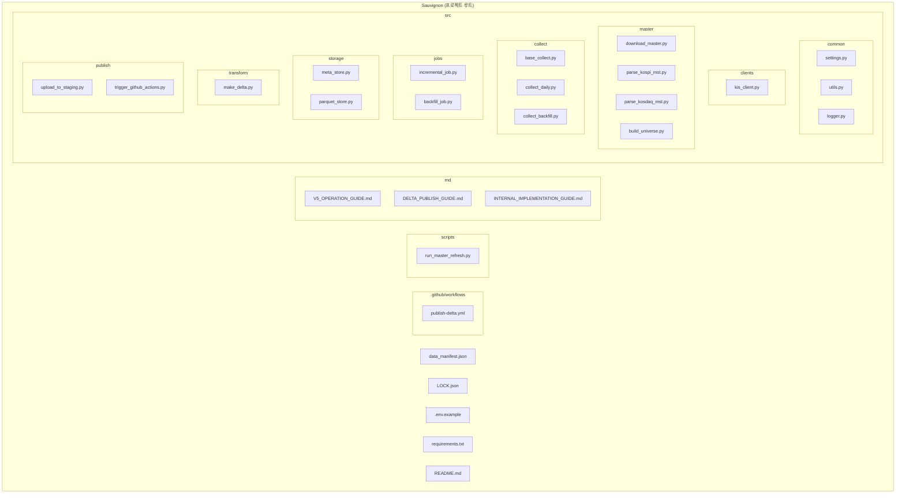
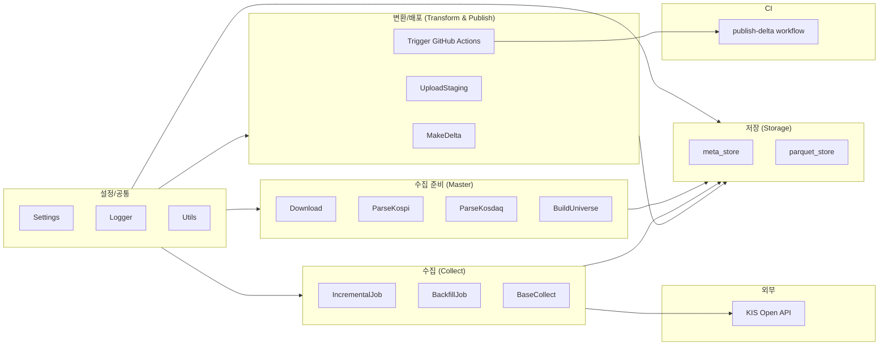
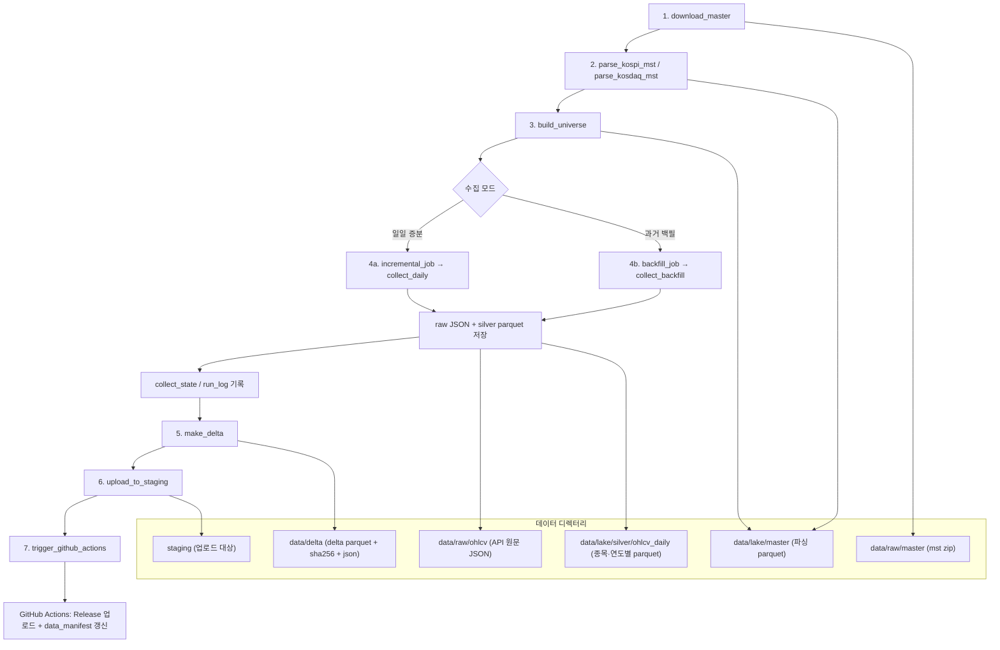
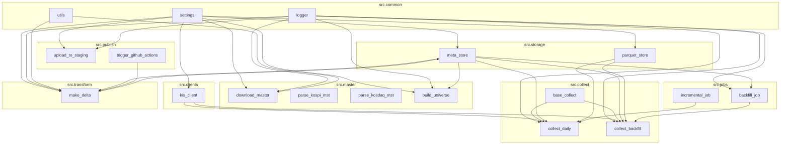
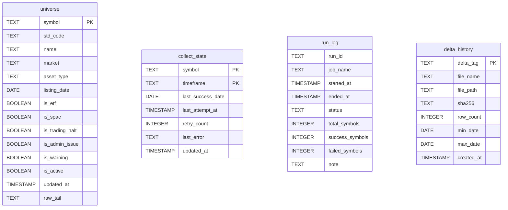
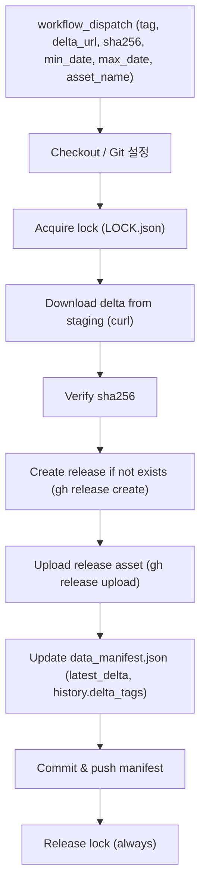

# KIS Data Platform v5 — 아키텍처 및 코드 구조

## 1. 프로젝트 폴더 구성

---

## 2. 레이어별 아키텍처

---

## 3. 데이터 플로우 (전체 운영 흐름)

---

## 4. 모듈 의존성 (코드 레벨)

---

## 5. 모듈별 구현 요약

### 5.1 common (설정·로깅·유틸)

| 파일 | 역할 | 주요 내용 |
|------|------|-----------|
| `settings.py` | 환경 설정 | `PROJECT_ROOT`, KIS API 키/URL, `STAGING_DIR`, `LOG_LEVEL`, `BACKFILL_CHUNK_DAYS` 등 `Settings` dataclass |
| `logger.py` | 로깅 | `get_logger(name)` — StreamHandler, 포맷, 레벨 설정 |
| `utils.py` | 유틸 | `sha256_file(path)`, `chunk_date_ranges(start, end, days)` |

### 5.2 clients (외부 API)

| 파일 | 역할 | 주요 내용 |
|------|------|-----------|
| `kis_client.py` | KIS Open API 클라이언트 | `KISConfig` / `KISClient`: `issue_token()`, `get_token()`, `request_get()`, `get_daily_ohlcv(symbol, start_date, end_date)` — Bearer 토큰 갱신, TR ID 헤더 |

### 5.3 master (종목 마스터)

| 파일 | 역할 | 주요 내용 |
|------|------|-----------|
| `download_master.py` | mst 다운로드 | KOSPI/KOSDAQ mst zip URL 다운로드 → 압축 해제 → `data/raw/master`, sha256 로깅 |
| `parse_kospi_mst.py` | 코스피 mst 파싱 | 고정폭 파싱: head(뒤 228자 제외) → symbol/std_code/name, tail → raw_tail, `data/lake/master/kospi_master.parquet` |
| `parse_kosdaq_mst.py` | 코스닥 mst 파싱 | 동일 구조, tail 222자 → `kosdaq_master.parquet` |
| `build_universe.py` | universe 생성 | kospi + kosdaq parquet 통합, SPAC 제외(옵션), DuckDB `universe` 테이블 replace, `universe.parquet` 저장 |

### 5.4 collect (일봉 수집)

| 파일 | 역할 | 주요 내용 |
|------|------|-----------|
| `base_collect.py` | 정규화·검증 | `normalize_ohlcv(symbol, market, payload)` — output2/output → 공통 스키마; `validate_ohlcv(df)` — 중복·가격·OHLC 관계 검증 |
| `collect_daily.py` | 일일 증분 수집 | universe 로드 → 종목별 KIS 호출 → raw JSON 저장 → 정규화/검증 → symbol·연도별 parquet upsert → `collect_state`/`run_log` 기록 |
| `collect_backfill.py` | 백필 수집 | `collect_one()` 단일 종목 수집; `run_parallel(rows, start, end, workers)` — ThreadPoolExecutor 병렬 수집 |

### 5.5 jobs (수집 오케스트레이션)

| 파일 | 역할 | 주요 내용 |
|------|------|-----------|
| `incremental_job.py` | 증분 수집 진입점 | `meta_store.ensure_tables()` → universe 로드 → `collect_daily.main()` 호출 |
| `backfill_job.py` | 백필 수집 진입점 | `ensure_tables()` → universe 로드 → `run_parallel()` → `meta_store.log_run()` |

### 5.6 storage (메타·파일 저장)

| 파일 | 역할 | 주요 내용 |
|------|------|-----------|
| `meta_store.py` | DuckDB 메타 DB | `meta/meta.duckdb`: `ensure_tables()` (universe, collect_state, run_log, delta_history), `replace_universe()`, `load_universe()`, `upsert_collect_state()`, `log_run()`, `record_delta()` |
| `parquet_store.py` | raw/silver 파일 | `save_raw_json(symbol, payload)` → `data/raw/ohlcv/{date}/{symbol}.json`; `write_symbol_parquet(df)` → `data/lake/silver/ohlcv_daily/market={market}/symbol={symbol}/year={year}/data.parquet` (기존 파일 merge 후 upsert) |

### 5.7 transform (Delta 생성)

| 파일 | 역할 | 주요 내용 |
|------|------|-----------|
| `make_delta.py` | Delta Parquet 생성 | 기간별 silver parquet 읽기(DuckDB `read_parquet`) → 단일 delta parquet + `.sha256` + `.json` manifest → `delta_history` 기록 |

### 5.8 publish (스테이징·릴리스 트리거)

| 파일 | 역할 | 주요 내용 |
|------|------|-----------|
| `upload_to_staging.py` | 스테이징 업로드 | `data/delta/{tag}.parquet/.sha256/.json` → `STAGING_DIR` 복사, 공개 URL 출력 |
| `trigger_github_actions.py` | 워크플로 디스패치 | manifest에서 sha256/min_date/max_date 읽어 `gh workflow run` 입력으로 전달 (tag, delta_url, sha256 등) |

---

## 6. 메타데이터 스키마 (DuckDB)

---

## 7. GitHub Actions (publish-delta)

---

## 8. 실행 순서 요약

| 단계 | 명령/모듈 | 설명 |
|------|-----------|------|
| 1 | `download_master` | KOSPI/KOSDAQ mst zip 다운로드 및 압축 해제 |
| 2 | `parse_kospi_mst`, `parse_kosdaq_mst` | mst 파싱 → lake/master parquet |
| 3 | `build_universe` | master 통합 → universe 테이블 및 universe.parquet |
| 4a | `incremental_job` | 일일 증분 수집 (collect_daily) |
| 4b | `backfill_job` | 장기 백필 수집 (collect_backfill, 병렬) |
| 5 | `make_delta` | 기간 지정 silver → delta parquet + manifest + delta_history |
| 6 | `upload_to_staging` | delta 파일들 스테이징 디렉터리로 복사 |
| 7 | `trigger_github_actions` | publish-delta 워크플로 실행 → Release 및 data_manifest 갱신 |

이 문서는 프로젝트 폴더 구성, 레이어 구조, 데이터 플로우, 모듈 의존성, 모듈별 구현 요약, 메타 스키마, CI 흐름을 머메이드 다이어그램과 표로 정리한 것입니다.
